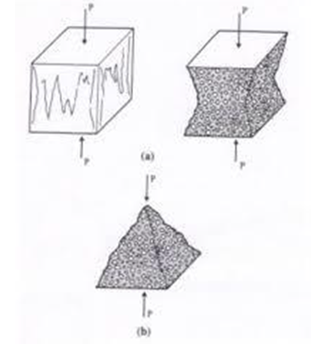
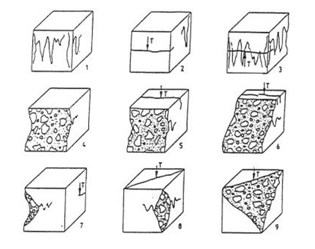

# Procedure
**Preparation of specimens:**
1. Specimens when received dry shall be kept in water for 24 h before they are taken for testing. Specimen shall be tested immediately on removal from the water whilst they are still wet. Surface water and grit shall be wiped off the specimens and any projecting fins removed from the surfaces which are to be in contact with the packing strips.  
**Measurement**
2. The mass and dimensions of the specimen shall be noted before testing.  
3. The length of thespecimen shall be taken to the nearest 0.2 mm.  
**Positioning**
4. The bearing surfaces of the testing machine and of theloading strips shall be wiped clean before positioning the specimen. 
5. Place the specimen in the CTM.Cube specimens shall be compressed perpendicularly to the direction of casting. 
6. The specimen shall be centered on the lower platen to an accuracy of 1% of the designated size of cubic or diameter of cylindrical specimen.  
**Rate of Loading**
7. The load shall be applied without shock and increasedcontinuously at a nominal rate of14 MPa/min until no greater load can be sustained.   
**Failure load**
8. The maximum load applied shall then be recorded. Theappearance of concrete and any unusual features in thetype of failure shall also be noted.  
**Assessment of type of failure**
If the failure for cube/cylinder specimens is satisfactory or unsatisfactory as shown in the following figures, this fact shall be recorded. 
If the failure pattern is unsatisfactory, then the type of failure recorded using the pattern number as shown in the following figures closest to that observed shall be indicated.  

Figure. Satisfactory failure of cube specimen  

Figure. Unsatisfactory failure of cube specimen  
**Observations and Calculation:**
Average of three values shall be taken as the representative of the batch provided the individualvariation is not more than ± 15 percent of the average. 
Otherwise repeat test shall be made,however if there is no further sample then the average of two closest values may be taken as the average result. 
The compressive strength shall be expressed to the nearest 0.5 MPa.  

The compressive strength is given by the equation
$$f_c = F/A_c $$
where fc = compressive strength, in MPa  
F = minimum load, in N and  
Ac = cross-sectional area (in mm2) of the specimen on which the compressive force acts.   

For _____________-day strength: 
Shape of specimen:  ______________ 
<table>
                 <tr>
                                <td>
                                         No.
                                </td>
                                 <td>
                                         Length (mm), L.
                                </td>
                                 <td>
                                         Breadth/Diameter (mm), B/D
                                </td>
                                 <td>
                                         Cross section area (mm2), Ac
                                </td>
                                 <td>
                                         Failure (Satisfactory / unsatisfactory)
                                </td>
                                 <td>
                                         Load at Failure (N), Fu
                                </td>
                               <td>
                                         Compressive Strength(N/mm2) fc = Fu/Ac
                                </td>
                                 <td>
                                         Check 0.85fca ≤ fc ≤ 1.15fca
                                </td>
                 </tr>
                 <tr>
                                <td>
                                         1
                                </td>
                                 <td>
                                </td>
                                 <td>
                                </td>
                                 <td>
                                </td>
                                 <td>
                                </td>
                                 <td>
                                </td>
                               <td>
                                </td>
                                 <td>
                                </td>
                 </tr>
                 <tr>
                                <td>
                                         2
                                </td>
                                 <td>
                                </td>
                                 <td>
                                </td>
                                 <td>
                                </td>
                                 <td>
                                </td>
                                 <td>
                                </td>
                               <td>
                                </td>
                                 <td>
                                </td>
                 </tr>
                <tr>
                                <td>
                                         3
                                </td>
                                 <td>
                                </td>
                                 <td>
                                </td>
                                 <td>
                                </td>
                                 <td>
                                </td>
                                 <td>
                                </td>
                               <td>
                                </td>
                                 <td>
                                </td>
                 </tr>
                 <tr>
                                <td colspan= 5>
                                         Average: fca
                                </td>
                                 <td>
                                </td>
                                 <td>
                                </td>
                                 <td>
                                </td>
                 </tr>
                 <tr>
                                <td colspan= 6>
                                         *Corrected Average, fca(if there is no further sample)
                                </td>
                                 <td>
                                </td>
                                 <td>
                                </td>
                 </tr>
</table>
**Results:**   
Date of test:   ____________________ 
Shape and size of the specimen in mm:   ____________________ 
Age of specimen at date of test:    ____________________ 
Weight of specimen in Newtons:  ____________________ 
Average Compressive strength:   ____________________ 
Type of failure (satisfactory or unsatisfactory):   ____________________  
**Precautions** 
1. Damaged specimens shall not be tested. 
2. The time between the extraction of the specimen from the curing tank until the test shall be as short as possible or not more than 2h. 
3. Cube specimens shall be compressed perpendicularly to the direction of casting. 
