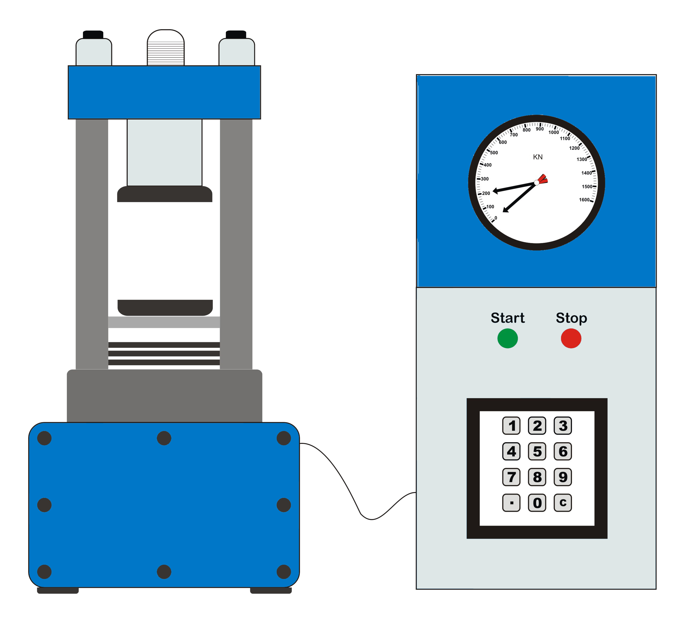

# Theory

Concrete as a material is valued for its compressive strength. Of all the properties of hardened concrete, compressive strength is the most important. Compressive strength of concrete is required for assuring the design strength. It is also used to obtain an estimate of flexural strength and elastic modulus by means of established relationships. 

$$E_c = 5000 \sqrt{f_{ck}} $$  

$$f_{ct} = 0.7 \sqrt{f_{ck}} $$

When a uniaxial load is applied upon a concrete specimen, it not only exhibits compressive strain in the direction of load, it also would exhibit some expansion in the lateral directions due to poisons effect, as manifested by the introduction of lateral tensile strain. 
A specimen tested in the compression testing machine is restrained from lateral expansion at its ends where it is compressed against the relatively stiff steel platen of the testing machine. This is equivalent to the introduction of some lateral radial compressive stresses in the specimen near the specimen steel platen interface due to interface shear stresses. Thus, near the interface, the concrete is subjected to multiaxial compressive stresses. This effect is called platen effect. The strength of a material is greater under multiaxial compressive stresses than under uniaxial compressive stress. 
The platen effect decreases away from the interface towards the center of the specimen. The effect is practically negligible beyond a section at a distance equal to the width of the specimen from the interface. Thus, the measured compressive strength decreases with increase in the height/lateral dimension ratio and is approximately equal to uniaxial compressive strength of concrete for values of this ratio equal to or greater than 2. For standard cylinders, this ratio is two and as such concrete cylinder strength is only about 0.80 times the cube strength whole height/lateral dimension is one. The platen effect can be eliminated by eliminating the interface shear stresses by applying lubricant such as grease at the interface, as this may allow the specimen to expand freely by removing the lateral compressive stress. But such a method may not result in consistent measurement and is not favored by standards.
The measured value of strength of concrete specimen is affected by rate of loading. It is low when the rate of loading is low. For the purpose of uniformity and meaningful comparison between different test results, the rate of loading has been specified as 14 MPa/min. 

## Apparatus:
The test machine shall be in calibration at the time of test. The calibration shall be carried out atleast once per year. 

| Name | Accuracy/Least count |
| ------ | ------ |
| Cubes | Conforming to IS: 1199 |
| Cylinders | Conforming to IS:1199|
| Compression Testing Machine (CTM) | 	Conforming to IS:14858 |
| Ruler | 	0.2 mm |
| Weighing device | 1 g |

Figure Compression Testing Machine  

Number of specimens: At least three specimens shall be tested for each age of tests. 
Testing conditions: Tests shall be made at the recognized ages of the test specimens, the most usual being 7 and 28 days. The ages shall be carried out from the time of addition of water to the dry ingredients.
