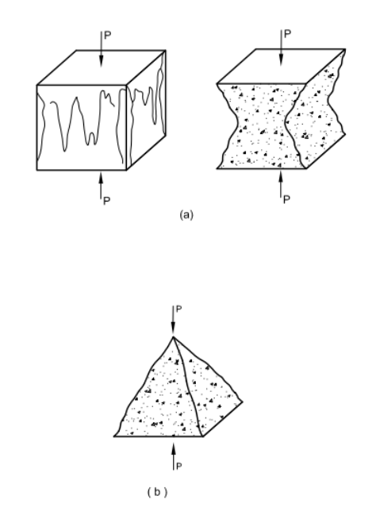

<h3> These steps will be followed for the experiment </h3>

<h5>Preparation of specimens:</h5>

1. Specimens when received dry shall be kept in water for 24 hours before they are taken for testing. Specimen shall be tested immediately on removal from the water whilst they are still wet. Surface water and grit shall be wiped off the specimens and any projecting fins removed from the surfaces which are to be in contact with the packing strips.

<h5>Measurement</h5>

1. The mass and dimensions of the specimen shall be noted before testing.

2. The length of the specimen shall be taken to the nearest 0.2 mm.

<h5>Positioning</h5>

1. The bearing surfaces of the testing machine and of the loading strips shall be wiped clean before positioning the specimen.

2. Place the specimen in the CTM. Cube specimens shall be compressed perpendicularly to the direction of casting.

3. The specimen shall be centered on the lower platen to an accuracy of 1 percent of the designated size of cubic, or diameter of cylindrical specimens.

<h5>Rate of Loading</h5>

1. The load shall be applied without shock and increased continuously at a nominal rate of 14 MPa/min.

<h5>Failure load</h5>

1. The load shall be applied without shock and increased continuously at a nominal rate of 14 MPa/min until no greater load can be sustained.

<h5>Assessment of type of failure</h5>

If the failure for cube/cylinder specimens is satisfactory or unsatisfactory as shown in the following figures, this fact shall be recorded.

If the failure pattern is unsatisfactory, then the type of failure recorded using the pattern number as shown in the following figures closest to that observed shall be indicated.

 

 
Figure. Satisfactory failure of cube specimen
  

 
Figure. Unsatisfactory failure of cube specimen  

<h5>Observations and Calculation:</h5>

The compressive strength is given by the equation: 

fc = F / Ac
 
where,
fc = tensile   strength, in MPa  
F = minimum load, in N  
Ac = cross-sectional area ( in mm2 ) of the specimen on which the tensile force acts.

Average of three values shall be taken as the representative of the batch provided the individual variation is not more than ± 15 percent of the average. 
Otherwise repeat test shall be made, however if there is no further sample then the average of two closest values may be taken as the average result. 
The compressive strength shall be expressed to the nearest 0.5 MPa.  
For _____________-day strength: 
Shape of specimen:  ______________ 

<table>
                 <tr>
                                <td>
                                         No.
                                </td>
                                 <td>
                                         Length (mm), L.
                                </td>
                                 <td>
                                         Breadth/Diameter (mm), B/D
                                </td>
                                 <td>
                                         Cross section area (mm2), Ac
                                </td>
                                 <td>
                                         Failure (Satisfactory / unsatisfactory)
                                </td>
                                 <td>
                                         Load at Failure (N), Fu
                                </td>
                               <td>
                                         Compressive Strength(N/mm2) fc = Fu/Ac
                                </td>
                                 <td>
                                         Check 0.85 fca≤fc≤1.15fca
                                </td>
                 </tr>
                 <tr>
                                <td>
                                         1
                                </td>
                                 <td>
                                </td>
                                 <td>
                                </td>
                                 <td>
                                </td>
                                 <td>
                                </td>
                                 <td>
                                </td>
                                 <td>
                                </td>
                                 <td>
                                </td>
                 </tr>
                 <tr>
                                <td>
                                         2
                                </td>
                                 <td>
                                </td>
                                 <td>
                                </td>
                                 <td>
                                </td>
                                 <td>
                                </td>
                                 <td>
                                </td>
                               <td>
                                </td>
                                 <td>
                                </td>
                 </tr>
                 <tr>
                                <td>
                                         3
                                </td>
                                 <td>
                                </td>
                                 <td>
                                </td>
                                 <td>
                                </td>
                                 <td>
                                </td>
                                 <td>
                                </td>
                               <td>
                                </td>
                                 <td>
                                </td>
                 </tr>
                 <tr>
                                <td colspan= 5>
                                         Average: fca
                                </td>
                                 <td>
                                </td>
                                 <td>
                                </td>
                                 <td>
                                </td>
                 </tr>
                 <tr>
                                <td colspan= 6>
                                         *Corrected Average, fca (if there is no further sample)
                                </td>
                                 <td>
                                </td>
                                 <td>
                                </td>
                 </tr>
</table>

<h5>Results:</h5>

Date of test:   ____________________ 

Shape and size of the specimen in mm:   ____________________ 

Age of specimen at date of test:    ____________________ 

Weight of specimen in Newtons:  ____________________ 

Average Compressive strength:   ____________________ 

Type of failure (satisfactory or unsatisfactory):   ____________________  

<h5>Precautions:</h5>

1. Damaged specimens shall not be tested. 
2. The time between the extraction of the specimen from the curing tank until the test shall be as short as possible or not more than 2 hours. 
3. Cube specimens shall be compressed perpendicularly to the direction of casting. 
4. The actual dimensions of test specimens shall conform to IS 10086. If the actual dimensions are within the tolerance limits as mentioned in IS 10086, the strength may be calculated on the basis of designated size. If the actual dimensions are outside this tolerance, the strength calculation shall be based on the actual dimensions of the test specimen, however, the perpendicularity of the surface of specimens should be maintained as per IS 10086. 
